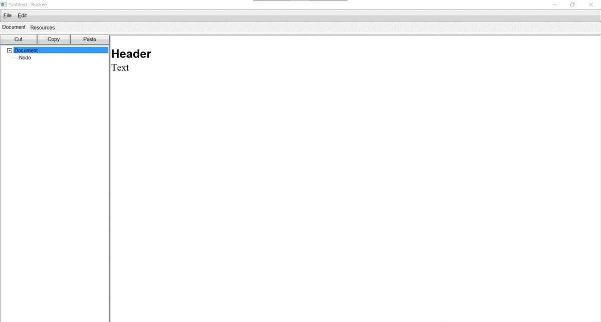

# Rustree

**Rustree** is a notepad that stores text (in HTML format) in a hierarchical
structure. (A document is a tree: it has a root node, which has child nodes,
which have child nodes, etc...). It was inspired by Treepad.

Tested only on Windows.



# Features

- **Rustree** has it's own binary document format: **.rtd** (***R***us***t***ree
  ***D***ocument). It also contains resources (currently only images) that can
  be used in the document (resources can be added in the **Resources** tab).
- **Rustree** has _eight_ themes (you can change the theme in the
  `File/Settings` menu).
- You can add references to other nodes in the document in the node text.
- **Rustree** is portable and small (2.5 mb).

<hr>

Read more about the **Rustree** in it's [manual](assets/manual.rtd) (download it
and open in the **Rustree** using the file menu or the shortcut
<kbd>Ctrl</kbd> +
<kbd>O</kbd>).

# Installation

To install **Rustree**, you need to install
**[Rust](https://www.rust-lang.org/tools/install)** and enter this command:

```
cargo install rustree
```
